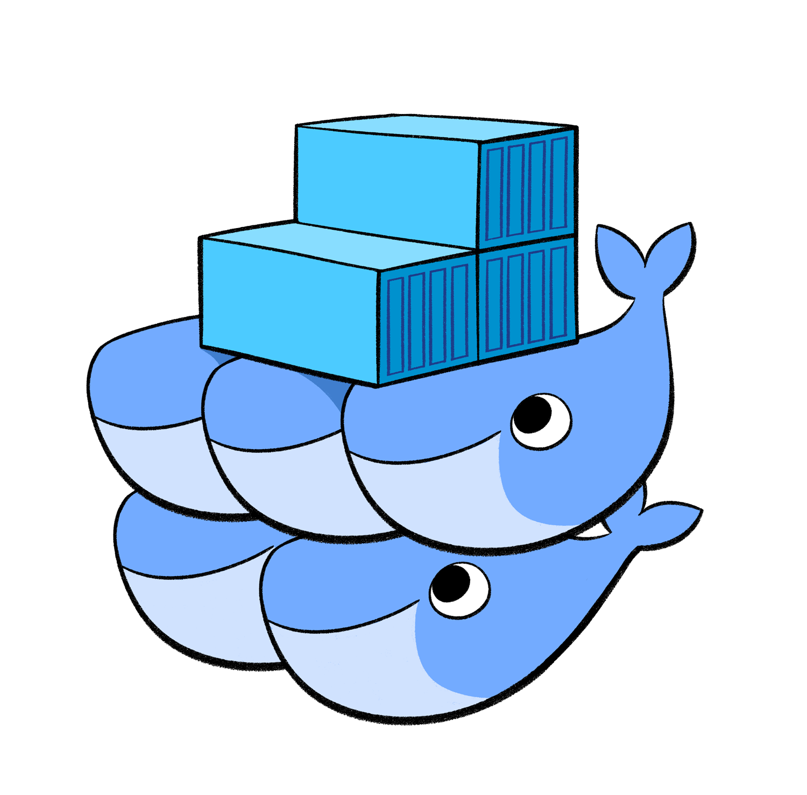
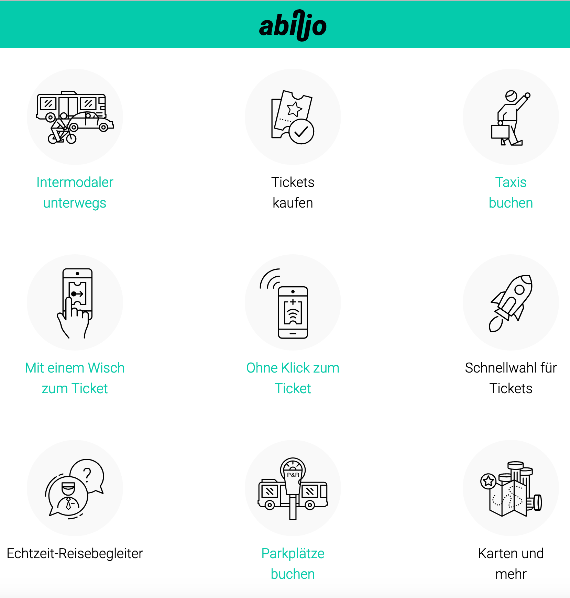
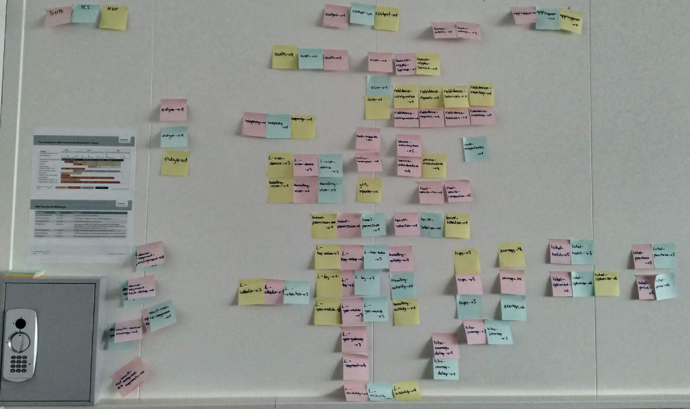

## Microservices and Kubernetes

Experiences made, working with Microservices and Kubernetes on AWS during one year

---

## Intro - Rise of the Containers

<table>
<tr>
  <td></td>
    <td>Docker</td>
</tr>

<tr>
  <td></td>
    <td>Docker Compose</td>
</tr>
</table>

+++

<table>
<tr>
  <td></td>
    <td>Docker Swarm</td>
</tr>
<tr>
  <td></td>
    <td>Kubernetes</td>
</tr>
<tr>
  <td> </td>
    <td>Openshift</td>
</tr>
</table>

---

## The Project

 [www.abilio.ch](https://www.abilio.ch/)  
 
 

Note:
Siemens biete die Platform an um die Abilio App zu betreiben.
Fahrten von Passagieren werden anhand von Sensor-Daten berechnet und das günstigte Ticket ausgewählt und gekauft

+++

### Tech Stack

- Container Platform: Kubernetes Cluster on AWS Cloud
- Database:
  - Cassandra Cluster on AWS Cloud
  - Postgres on AWS Cloud
- Message Queue: Kafka Cluster on AWS Cloud
- App: Xamarin Mobile Apps and common Mobile-SDK

+++

- Microservices Languages:

  - Java Spring Microservices
  - React Frontend "Cockpit"
  - Python PDF processing

+++

- Tools Microservices:
  - Grafana
  - Kibana
  - Nginx as Gateway
  - Gitlab Pipelines
  
+++
### Team

- Ops team in India
- Dev Team :
  - 1 Siemens Ops Team Coordinator
  - 6 backend developers Noser Engineering
  - 2 frontend developers Noser Engineering
  - 3 Mobile developers Noser Engineering
  - 2 Hardware developers Siemens
  - 1 PO Siemens
  - 1 Team Leader / Tech Lead Noser Engineering
  - 1 Mathematician Siemens Munich

---

## Working with Kubernetes and Microservices

  

+++

### Cluster

- 3 Environments: dev, staging, prod
- Dev & staging AWS Ireland
- Prod AWS Frankfurt, no access rights for developers
- Multi tenancy with namespaces in clusters
- Access via identity file and ssh
- Scaling services was done manually
- Tools
  - ELK
  - Grafana
  - Cockpit-App

+++

### Setup/Organisation of Microservices

- 1 git repo per service, versioning per service
- Corresponding config files in config-repo:
  - config for using properties
  - deployment/file Kubernetes
- Cassandra keyspace per service per client
- Kafka topics per event-stream and client

+++

### Working on Microservices

- Small code repos
- Simple Tasks:
  - Read Kafka topic
  - Process message
  - Calculate
  - Store in db
  - Write to Kafka topic
  - Rest-controller
- Serialize / Deserialize json

+++

### Development on Microservices

- Java & Kotlin mixed
- Spring Boot Jars
- 1 Parent Pom for managing Spring Boot Version
- Support Libs as abstraction for Cassandra, Kafka, Http
- Bash working with kubectl:
  - list all pods
  - apply config for pod-xy
  - list config/deployment
  - kill pod

+++

### Testing on a Microservices

- Port-forwarding for local development, Dev cluster used heavenly by developers
- Automated API Tests for each Service with Postman
- Replay of old journeys from staging or prod
- Fake model train in office-space which drives a test- S-Bahn line all day long

+++

### Tools used for Development

- Docker-Compose
- Postman
- SSH port-forwarding
- Bash scripts/tools provided by Cassandra & Kafka

---

## The Pro's

- Focus on small functions
- Independent deployment of releases
- Deployment of release means pod starting with new Docker-Image version
- Zero downtime deployment
- Usage of Kafka:
  - dead-letter-queue
  - measure metrics on Kafka queues
  - replay journeys in different environments
- Build own pragmatic Liquibase approach for Cassandra

---

## The Con's

- Config files hell
- Dependencies on deployment
- Maven transitive clashing dependencies
- Losing overview of services and their version
- Complex management of requirements for multiple microservices
- Frequent release cycles -> fix bugs for external interfaces
- Handling of multi tenancy was introduced after first releases

---

## Wrap Up

- Use:
  - Managed Kubernetes (upgrade kubernetes cluster was hard)
  - API-Gateways
  - Service-Discovery
  - Cloud Config Service/Framework
- Think about applying multi tenancy first
- Bleeding edge is not always fun (spring-data Cassandra release was to late)
- Think about when/how remove old microservices

